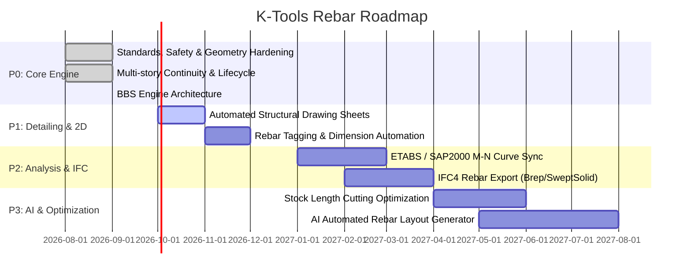

# K-Tools Rebar Engineering Roadmap (2026 - 2027)

This document outlines the strategic engineering roadmap for **KhimTools RebarTool** to maintain industry leadership in structural BIM automation.

---

## Milestone Overview

---

## Phase P0: Core Production Engine (COMPLETED - Q3 2026)

- [x] **Universal Standards Strategy Engine**: Full implementation of Eurocode 2 (EN 1992-1-1) and TCVN 5574:2018 (mandrel diameters, clear spacing, hook tails, lap splices, anchorage).
- [x] **Elimination of Silent Design Degradation**: Total removal of empty `catch` blocks in `RebarShapeCreationHelper`; transparent fallback reporting.
- [x] **Safety & Stock Length Validator**: Automatic detection of bars exceeding commercial length ($11.7\text{m}$), minimum clear spacing violations ($\le 25\text{mm}$), and solid-aware host containment.
- [x] **Local Coordinate Framework for Slabs**: Slicing and interval generation in local planar $(\vec{u}, \vec{v})$ frame; support for rotated slabs, polygons, L/T shapes, and opening trimmer bars.
- [x] **Multi-Story Column Continuity Engine**: Automated vertical column stack detection, dynamic 1:6 crank slope with section transitions, $>75\text{mm}$ dowel separation, and 50% staggered splices.
- [x] **Starter Dowel Geometry Correction**: Footing starter dowels query actual supported structural columns and footing rotation rather than 40% estimates.
- [x] **Rebar Lifecycle & Duplicate Prevention**: `RebarLifecycleManager` tagging rebars with metadata and executing safe cleanups on `REBUILD` / `UPDATE`.
- [x] **Bar Bending Schedule (BBS) Engine**: Complete shape extraction, bar weight aggregation, and CSV/Excel export.

---

## Phase P1: Automated Detailing & 2D Documentation (Q4 2026)

### 1. Automated Drawing & Sheet Generation
- **Target**: Generate a complete structural drawing sheet with 1 click:
  - Plan view of the element (Beam, Column, Slab, Footing) with rebar visibility set to Unobscured and Solid in 3D.
  - Longitudinal cross-section view with level benchmarks and rebar callouts.
  - Transverse cross-sections at supports (A1) and midspan (A2).
  - Native Revit Schedule placed on the sheet linking directly to the generated rebars.

### 2. Intelligent Rebar Tagging & Annotations
- Automatically place multi-rebar annotations (`MultiRebarAnnotation`) or independent rebar tags.
- Leader lines automatically arranged with zero text-leader collisions.
- Dimension chains between main bars and stirrups.

### 3. Bar Bending Diagram (Shape Detailing) in 2D
- Draw schematic 2D bar shape diagrams with segment lengths ($A, B, C, D, E$) inside the schedule or sheet legend.

---

## Phase P2: Analysis Sync & Interoperability (Q1 2027)

### 1. ETABS / SAP2000 Integration
- Import structural analysis forces ($P, M_x, M_y, V_x, V_y, T$) from ETABS database files (`.edb`, `.s2k`).
- Compare provided rebar area $A_{s,prov}$ against required rebar area $A_{s,req}$ from analysis.
- Visualize rebar capacity ratio (P-M interaction diagram) directly within Revit 3D views.

### 2. IFC4 Certified Rebar Export
- Export reinforcement as true IFC structural entities (`IfcReinforcingBar`) using `IfcAdvancedBrep` or `IfcSweptDiskSolid`.
- Ensure lossless export to Tekla Structures, Allplan, and Solibri for clash detection and fabrication.

---

## Phase P3: AI Optimization & Fabrication (Q2 2027)

### 1. 1D Stock Length Cutting Stock Optimization (1D Bin Packing)
- Input: Entire project BBS list of cut lengths.
- Stock bars: $11.7\text{m}$ (standard) and $12.0\text{m}$.
- Algorithm: Linear programming / genetic algorithm to minimize rebar wastage down to $< 1.5\%$.
- Output: Cutting list and bar pairing plan for fabrication yards.

### 2. Reinforcement Layout AI Co-Pilot
- Neural-assisted optimal bar diameter and bar count selection based on moment envelopes and cost efficiency.
- Automated lap splice location shifting to regions of lower stress ($M_{max} / 3$).
